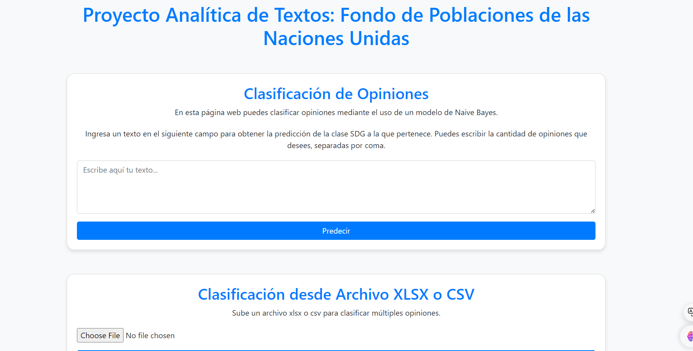

# Proy_BI_G38

- Maria Alejandra Lizarazo - 202021385
- Alejandro González Salazar - 201921465
- Daniel Gómez Rey - 202122586

# Guía de Uso de la Aplicación con la API

## 1. Clonar repositorio

```bash
git clone https://github.com/dgomezrey/Proy_BI_G38.git
```
## 2. Instalar Dependencias

Asegúrate de que todas las dependencias necesarias estén instaladas para que la aplicación funcione correctamente. Instala todas con el siguiente comando.

```bash
pip install -r requirements.txt
```

## 3. Ejecutar la API

Una vez que tengas todas las dependencias listas, navega a la carpeta `API_V` y ejecuta el archivo `api.py`. Puedes hacerlo con el siguiente comando:

```bash
python API_V/api.py
```

o 

```bash
python3 API_V/api.py
```

## 4. Acceder a la aplicacion

Después de ejecutar el archivo, abre tu navegador y accede a la siguiente dirección:

```
http://localhost:5000
```

Esto te permitirá interactuar con la API desde el navegador.

Se deberia ver algo asi :

